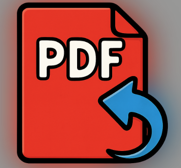

## PDFRenamer

A chrome extension that should allow you to more easily download and rename PDF files.

#### An Overview Of PDFRenamer

Are you ever frustrated by the naming that you get when you download a PDF?  

Many websites will give you strange names, generic names, or names that are not descriptive.  Then you look at the file many months later and you ask yourself what in the world was this file about. About the best you can do is try to put them into a sub directory where maybe you do have something labeled correctly.

This extension was made to try and help solve this issue. I also enforce a strong naming convention which I believe will simplify your life. Currently the extension is not set up to be general purpose but to specifically create a dense amount of information in your file name so that if you see it inside of your computer, you should have a good idea.  So see if the following is acceptable:

A file should have:

a. A date on front of it that can be quickly sorted in a file system
b. A section that describes what is in the file
c. A section that shows where it was downloaded from

#####  A date on front of it that can be quickly sorted in a file system

Having your files in chronological order is really helps to scan through the files.  Most systems carry metadata, which should tell you when a file was made and when it was modified.  But some programs don't show this, and sometimes it gets lost.  So all files will be labels as YEAR then MONTH then DAY.

While this may look awkward at first, this means you can quickly sort the files up and down in any file explorer.  

##### A section that describes what is in the file

Sometimes titles are very misleading.  Therefore, this extension simply allows you to hilight any section of the text and click copy.  If you do this, then whatever phrase you selected can be loaded into the name box in the extension.  Or you can type your own name.  If you load it from your copy, you can also modify it in the box.

##### A section that shows where it was downloaded from

The final thing is putting in the subdomain next to the website.   So if you download from www.etrade.com it will put etrade into the final part of the file name.  However, sometimes you want to download a document but the website doesn't really help.  For example, you want to download a lot of Morgan Stanley reports from etrade.  You can modify the domain_map.csv file to translate from "etrade" to "MS" and look at the samples.

##### Problems With The Extension

Under the extension detail you may get an error once in a while.  This is because you're trying to capture the window clipboard and then pass it around to various elements which are getting focused and unfocused, and sometimes something may not quite hook up perfectly. This is nothing to be alarmed about and chances are I have no idea if anybody else will ever use this so I'm not going to spend any more time writing robust air handling to catch something which is inconsequential. This is a live with it statement.

Because this attempts to grab all download, the extension shuts itself off in 60 minutes.  You need to enable it every session.  There was a time when I was doing a massive download of PD FS and forgot it was turned on. I'm never going to have this extension so it runs all the time without user intervention.

Also, this extension works best when a website opens up the PDF in a new windows, then then you can download the PDF once you see it.  You simply copy something from the PDF and hit the extension button.  Unfortunately, some websites simply start downloading PDFs.  Unfortunatley, the extension does not always handle this gracefully and you will need to try different things.  Generally, you'll want to copy something into your computer buffer, open the extension, set the date and file name, and then rather than hit the download button, you may be able to click on the file to get it to download with part of the new name.  

Generally if you have a website where the file is going to automatically download the first time you click on hypertext link, what you will need to do is open up the extension set the date make sure that your clipboard is enabled inside of the pull down You may be able to leave it and actually click on the web page and it may put it in to the file name as it gets downloaded. Or perhaps it won't. I make no guarantees and you'll have to figure this out yourself.

Future versions will look at potential to solve this.

By the way, this name will be inserted into a dialog box for your approval before downloading and saving the file.  For example, I have a tendency to download a lot of reports on various companies, almost always the report starts off with the title, which turns out to be a good name for the file.

Now select the extension icon that you pinned to your browser bar.  You will get a dialog box that gives you the following options.

#### Demonstration Pictures

If you pin the extension to your browser bar, look for this icon.

Here is the drop down menu:

The top slider enables the extension, and you get your count down timer.

The next line can be updated by the user, or you can hit the - and + keys to increment by one.

Once you have the date you want for all you files, hit enter.  It will stay until reset.  In this example, we are still showing the previous date.

The next drop down box toggles either 6 or 8 digit dates.  I suggest 6 unless you have 100 years of data.

Below this is a box that can be populated by pressing the button to load what you have copied in your clipboard or you can write you own name.  Or do both and trade back and forth.

The final name is down at the bottom, and download it with the button.

The other buttons really don't need to be used Unless you have a problem with the bottom button or unless you wanna turn off the extension. 

The save button will save the format of the year according to whatever the pull down box says. The other button to capture something off the clipboard is only if you determine that you want to save using the chrome download button that is actually on the pdf. As long as you have the extension icon up and easy to get to it makes more sense to simply use the lowest button, which both uses the clipboard to rename the file and also download the file.  You will still get once more chance by the system to rename the file and change where it download if you browser has this option enabled.
#### How to install

This is set up as a developer Chrome extension. What this means is you need to download the content of this github into a subdirectory. This subdirectory can have any name but an example would be C:\extensions\PDFRenamer.

**How to Install a Developer Chrome Extension (Unpacked Extension)**

1. **Prepare the Extension Files**
   - Make sure you have the extension files in a folder. as written about above, where I give the example\PDFRenamer.
  
2. **Open the Extensions Page in Chrome**
   - Open Google Chrome.
   - In the address bar, type:  
     `chrome://extensions`  
     and press Enter.

3. **Enable Developer Mode**
   - At the top right of the Extensions page, turn on the toggle for **Developer mode**.

4. **Load the Unpacked Extension**
   - Click the **Load unpacked** button (usually at the top left).
   - In the dialog that appears, navigate to the folder where your extension files are located.
   - Select the folder and click **Select Folder**.

5. **Verify Installation**
   - The extension should now appear in your list of extensions.
   - The extension has an icon, so it will also appear in your Chrome toolbar. Pin it for easy access by clicking the puzzle piece icon and then the pin next to your extension.

6. **Using the Extension**
   - Click the extension’s icon in the toolbar to use it.  This will bring up a dialog box for you to save the PDF, and it is the easiest way for you to use the extension.

7. **Updating the Extension**
   - If you make changes to the extension’s files, return to the `chrome://extensions` page and click the **refresh** icon (⟳) next to your extension to reload it.

**Note:**  
- The extension will only work as long as the files remain in the folder you selected. Don’t move or delete the folder unless you want to remove the extension.
- You may see a warning about developer mode; this is normal for unpacked extensions. You normally need to do something like reauthorized developer extensions every two weeks.

#### Fixes

Note original version push to get hub had an issue where the pull down box for the extension had a non operational checkbox that would not turn off the extension when checked and saved. This has been fixed with the version here.